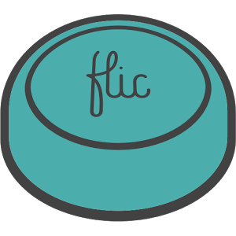
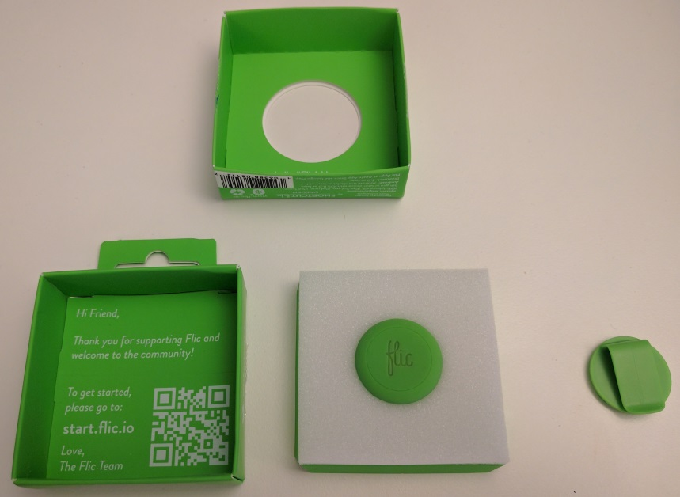

# Flic.io - Official Android SDK



This SDK library can be used to create your own functionality for flic buttons. Buy buttons at [https://flic.io](https://flic.io). See the tutorial at https://flic.io/partners/developers/android-tutorial for more info.



# How to use the library?

[  ](https://bintray.com/kucherenko-alex/android/io.flic%3Asdk/_latestVersion)


```groovy
/* Register custom repository. */
repositories {
    maven {
        url  "http://dl.bintray.com/kucherenko-alex/android"
    }
}

/* Include dependency into project. */
dependencies {
    compile 'io.flic:sdk:1.0.1.24'
}
```

Integrate in the app:

```java
// Replace appId and appSecret with your credentials
// and appName with a friendly name of your app

FlicManager.setAppCredentials("[appId]", "[appSecret]", "[appName]");
```

Continue reading [Official Android Integration Tutorial](https://partners.flic.io/partners/developers/android-tutorial)...

# Contributors

* [Oleksandr Kucherenko](https://github.com/OleksandrKucherenko)